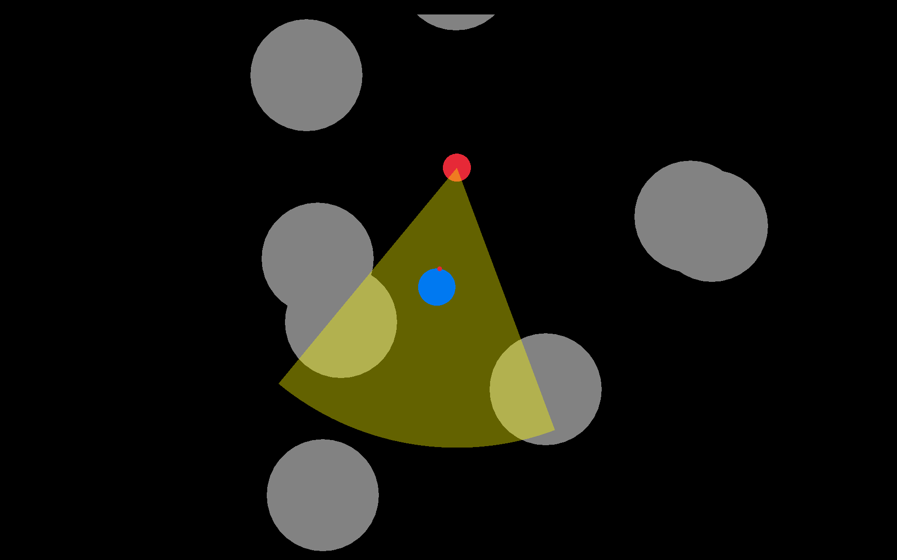
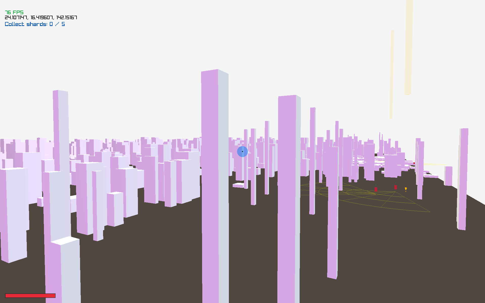

# Raylib Game Development

Learning C++ and game programming through a series of progressively more complex projects, each one adding new techniques on top of the last.

#### Installing Dependencies
Unix
```
sudo apt install clang-format cmake ninja-build pkg-config zip
```

Windows 
```
winget install Ninja-build.Ninja
```
[Visual Studio C++ Build Tools](https://visualstudio.microsoft.com/downloads/)

***

## Projects

#### 00_jump
Simple side-scrolling jumper. First steps with Raylib, C++ syntax, and working with classes.

Build system: Premake, Make


---

#### 01_collect
Top-down coin collector with a chasing enemy. Getting comfortable with C++ and Raylib fundamentals.

Build system: Premake, Make


---

#### 02_hide
Top-down stealth game — player must hide from a searching enemy. Working with pointers and better game abstractions.

Build system: Premake, Make



---

#### 03_shoot
First-person shooter with patrolling enemies. Refining game abstractions, switching to CMake.

Build system: CMake, Ninja


---

#### 04_teleport
Larger game world with a teleportation mechanic. Introduces vcpkg, shaders, meshes, and lighting.

Build system: vcpkg, CMake, Ninja


---

#### 05_explore
Open-world stealth exploration: blink across a procedural pillar field, collect
shards guarded by behaviour-tree enemies, and bring them home. Behaviour tree AI,
custom GLSL shaders, and an Emscripten web build playable right in the browser.

Build system: vcpkg, CMake, Ninja, Emscripten (web)



---

## Building

Projects `00_jump` through `02_hide` use Premake and Make:
```bash
cd src/00_jump
make
```

Projects `03_shoot`, `04_teleport` and `05_explore` use CMake and Ninja. Each has
its own `build.sh`:
```bash
bash src/03_shoot/build.sh
```
The vcpkg toolchain path inside `build.sh` differs per machine (see the script
for the macOS and WSL variants).

`04_teleport` and later projects require [vcpkg](https://learn.microsoft.com/en-us/vcpkg/get_started/get-started) installed in the parent directory of this repo.

Dependencies (Linux/WSL):
```bash
sudo apt install clang-format cmake ninja-build pkg-config zip
```

#### Web build

`05_explore` additionally builds for the browser with
[Emscripten](https://emscripten.org/) (`brew install emscripten`):
```bash
bash src/05_explore/build-web.sh
```
This compiles the game to WebAssembly and publishes the bundle into
`docs/games/05_explore/`, which is what the GitHub Pages site serves.
