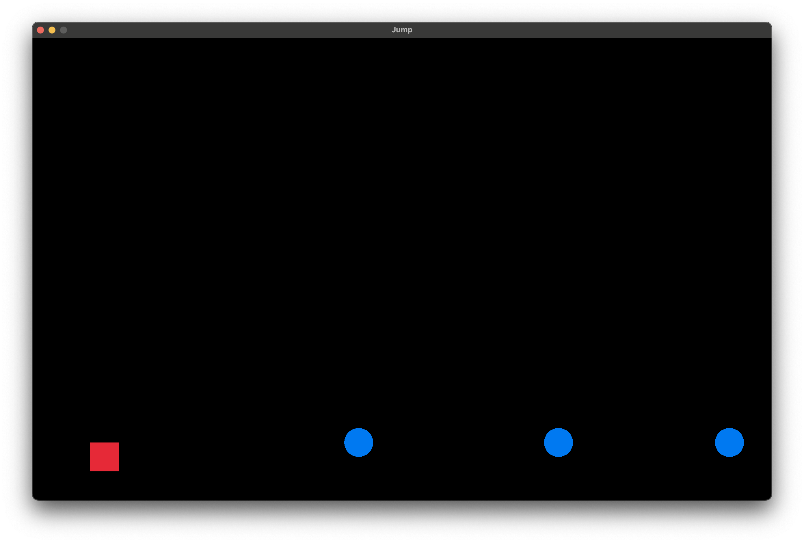
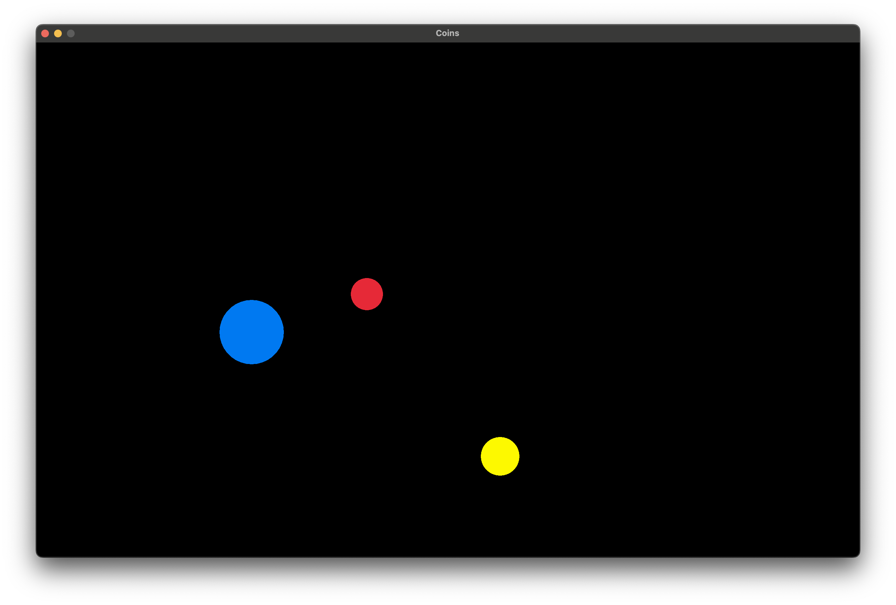
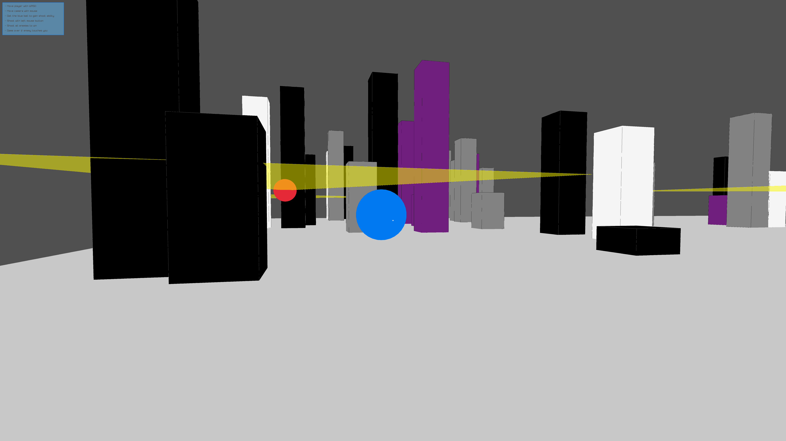
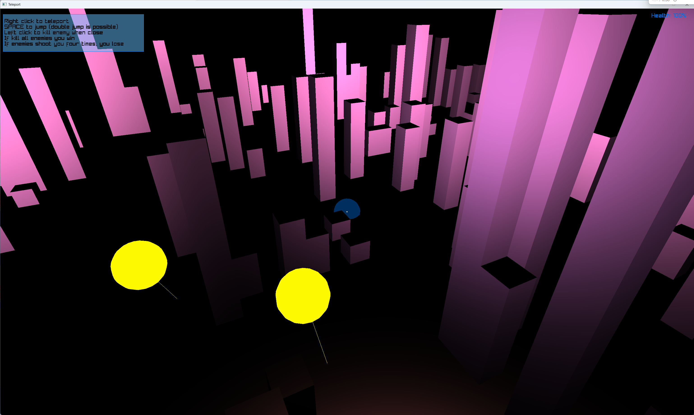

# Raylib Game Development

Learning C++ and game programming through a series of progressively more complex projects, each one adding new techniques on top of the last.

#### Installing Dependencies
Unix
```
sudo apt install clang-format cmake ninja-build pkg-config zip
```

Windows 
```
winget install Ninja-build.Ninja
```
[Visual Studio C++ Build Tools](https://visualstudio.microsoft.com/downloads/)

***

## Projects

#### 00_jump
Simple side-scrolling jumper. First steps with Raylib, C++ syntax, and working with classes.

Build system: Premake, Make



---

#### 01_collect
Top-down coin collector with a chasing enemy. Getting comfortable with C++ and Raylib fundamentals.

Build system: Premake, Make



---

#### 02_hide
Top-down stealth game — player must hide from a searching enemy. Working with pointers and better game abstractions.

Build system: Premake, Make


---

#### 03_shoot
First-person shooter with patrolling enemies. Refining game abstractions, switching to CMake.

Build system: CMake, Ninja



---

#### 04_teleport
Larger game world with a teleportation mechanic. Introduces vcpkg, shaders, meshes, and lighting.

Build system: vcpkg, CMake, Ninja



---

#### 05_explore *(in progress)*
Open-world exploration game with a behaviour tree AI system and custom shaders.

Build system: vcpkg, CMake, Ninja

---

#### 06_converse *(in progress)*
Prototype for an LLM-driven narrative engine integrated into a Raylib game loop. Runs llama.cpp inference on a background thread alongside the renderer so the game never blocks — tokens arrive frame by frame. Includes a layered architecture (runtime → worker → scheduler) and an in-engine developer workspace for iterating on generative content.

Build system: vcpkg, CMake, Ninja

---

## Building

Projects `00_jump` through `02_hide` use Premake and Make:
```bash
cd src/00_jump
make
```

Projects `03_shoot` and `04_teleport` use CMake and Ninja. Each has its own `build.sh`:
```bash
bash src/03_shoot/build.sh
# or from the repo root:
./build.sh 03_shoot
```

`04_teleport` and later projects require [vcpkg](https://learn.microsoft.com/en-us/vcpkg/get_started/get-started) installed in the parent directory of this repo.

Dependencies (Linux/WSL):
```bash
sudo apt install clang-format cmake ninja-build pkg-config zip
```
